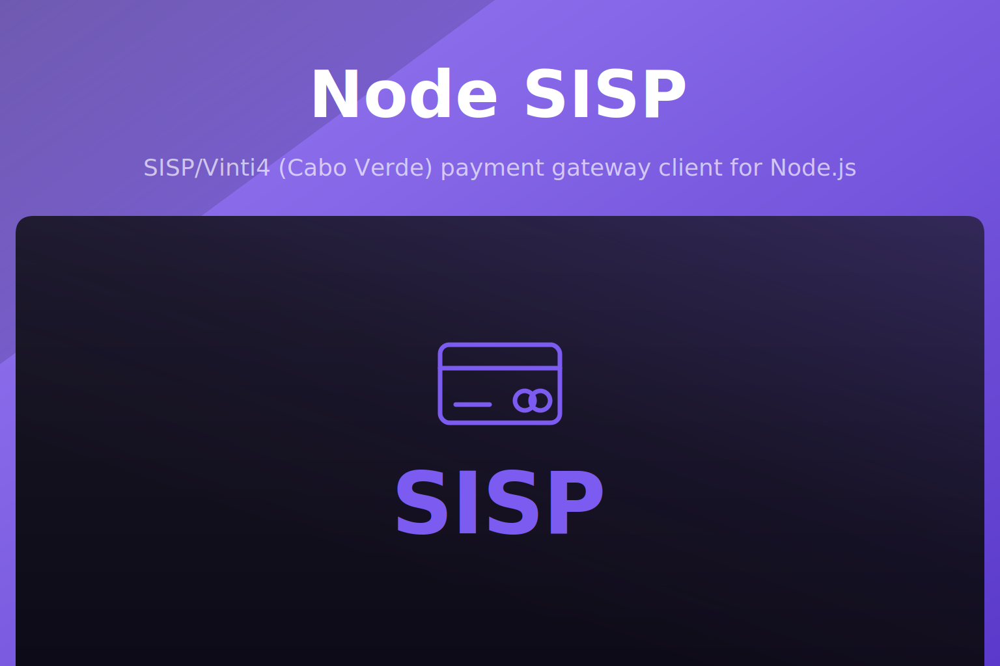

<p align="center">
  
</p>

<p align="center">
  <a href="https://www.npmjs.com/package/@akira-io/sisp"></a>
  <a href="https://www.npmjs.com/package/@akira-io/sisp"></a>
  <a href="https://github.com/akira-io/node-sisp/actions/workflows/ci.yml"></a>
  
  
  
</p>

> [!WARNING]
> Beta software. The API may change before `1.0.0`. Install with the `beta` tag: `npm install @akira-io/sisp@beta`. Pin an exact version in production and review the [changelog](CHANGELOG.md) before upgrading.

Framework-agnostic Node.js client for the SISP/Vinti4 payment gateway (Cabo Verde), ported from [akira-io/laravel-sisp](https://github.com/akira-io/laravel-sisp). Signed payment requests, callback validation, refunds, retries, reconciliation, a local sandbox gateway, and thin adapters for Express, Fastify, and NestJS, all backed by a bundled database schema with byte-for-byte fingerprint parity against the PHP implementation.

## Install

```sh
# npm
npm install @akira-io/sisp

# pnpm
pnpm add @akira-io/sisp

# yarn
yarn add @akira-io/sisp

# bun
bun add @akira-io/sisp
```

Add the database driver you use (`better-sqlite3`, `pg`, or `mysql2`) and the framework peer for the HTTP routes. Fastify is the default adapter; Express and NestJS are supported as well. All of them are optional peer dependencies.

```json
{
  "dependencies": {
    "@akira-io/sisp": "^0.1",
    "@fastify/formbody": "^8",
    "better-sqlite3": "^12",
    "fastify": "^5"
  }
}
```

## Quick start

```ts
import { createSisp } from '@akira-io/sisp';
import { sispFastifyPlugin } from '@akira-io/sisp/fastify';
import Fastify from 'fastify';

const sisp = await createSisp({
  posId: process.env.SISP_POS_ID,
  posAutCode: process.env.SISP_POS_AUT_CODE,
  url: process.env.SISP_URL,
  appKey: process.env.APP_KEY,
  baseUrl: 'https://app.example.cv',
  sandbox: true,
  database: { client: 'better-sqlite3', connection: { filename: './sisp.db' } },
});

const app = Fastify();
await app.register(sispFastifyPlugin, { sisp, prefix: '/sisp' });

sisp.on('payment:completed', ({ transaction }) => {
  fulfillOrder(transaction.merchant_ref, transaction.amount_cents);
});

const request = sisp.payment().amount(1500).customerEmail('a@b.cv').build();
await sisp.refund(transaction).full().reason('customer_request').process();

await app.listen({ port: 3000 });
```

Prefer Express or NestJS? See the [adapters guide](docs/06-adapters.md).

## Documentation

- [Index](docs/00-index.md)
- [Installation](docs/01-installation.md)
- [Configuration](docs/02-configuration.md)
- [Quick Start](docs/03-quick-start.md)
- [Payment Flow](docs/04-payment-flow.md)
- [Transaction Management](docs/05-transaction-management.md)
- [Adapters](docs/06-adapters.md)
- [Security](docs/07-security.md)
- [Sandbox and Testing](docs/08-sandbox-testing.md)
- [API Reference](docs/09-api-reference.md)
- [Architecture](docs/10-architecture.md)

## Testing

```sh
npm test
```

## Changelog

Please see [CHANGELOG.md](CHANGELOG.md) for what has changed recently. The changelog is generated
from conventional commits via [git-cliff](https://git-cliff.org) on every release tag.

## Contributing

Please see [CONTRIBUTING.md](CONTRIBUTING.md) for details.

## Security Vulnerabilities

Please review [our security policy](SECURITY.md) on how to report security vulnerabilities.

## Credits

- [Kidiatoliny](https://github.com/kidiatoliny)
- [All Contributors](https://github.com/akira-io/node-sisp/graphs/contributors)

## License

Dual-licensed under either of the following, at your option:

- MIT License ([LICENSE-MIT](LICENSE-MIT) or https://opensource.org/licenses/MIT)
- Apache License 2.0 ([LICENSE-APACHE](LICENSE-APACHE) or https://www.apache.org/licenses/LICENSE-2.0)

Unless you explicitly state otherwise, any contribution intentionally submitted for inclusion in
this project by you, as defined in the Apache-2.0 license, shall be dual-licensed as above, without
any additional terms or conditions.
